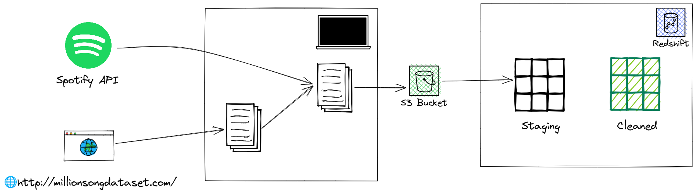
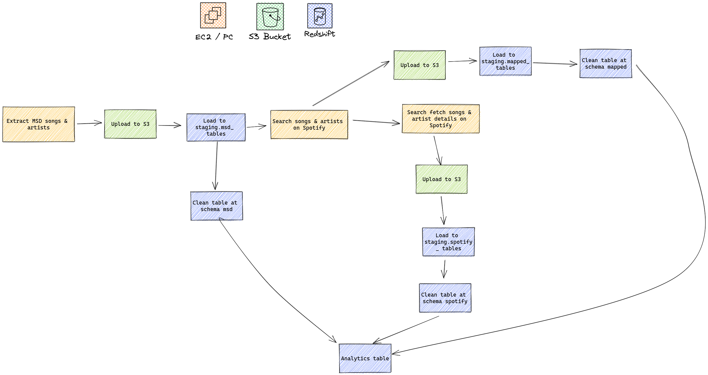

# Music ETL

## Goal
With this project, I aim to combine the real Million Song Dataset with data coming from Spotify API. With this pipeline, new researchers that are already familiar with the old Million Song Dataset to get new information for all the songs in Spotify, like new audio features, song popularity, artist popularity...

## Architecture

### Components
- Data sources
    - [Million Song Dataset](http://millionsongdataset.com/): We will use the actual MSD dataset in its original data format (HDF5). The full dataset (280 GB) can be accessed via AWS marketplace, and for development purpose we will use their subset (1.8 GB)
    - [Spotify API](https://developer.spotify.com/documentation/web-api/)
- Data storage:
    - Amazon S3: for JSON data staging
    - Amazon Redshift: for final analytics table storage. In reality, this is also the place where end-users query the final data tables for analytics purposes, so a database that can handle large query workload is necessary
- Orchestrator: [Prefect](https://www.prefect.io/). This is a new workflow orchestrator that are simpler to deploy and use than Airflow. It is also easier to use thanks to the syntax being closer to Python's syntax.
- Processing
    - Amazon EC2: For production, we need to access the MSD dataset on Amazon Workspace, and EC2 is needed to do that. 
    - Personal computer: for development purpose, it is sufficient to run everything in a personal machine.
- Terraform: for easy infrastructure set up.

### ETL flow
- At the moment, the flow is configured to run for one time only. 
- In case we want to regularly update the songs & artists list, instead of using the Million Song Dataset, we can figure out a way to get updated songs & artists list on Spotify.
- Overview of the workflow:

    
    

## Installation
Please refer to the [Installation guide](./INSTALL.md)

## Data Dictionary

Please refer to the [Data Dictionary](./DATA_DICTIONARY.md) file.

## How to get data
### Access the full Million Song Dataset
The official guide to access the full dataset is [here](ht://millionsongdataset.com/pages/getting-dataset/). 
The terraform scripts provided in this repo will automatically give you access to the dataset via EC2.

### Get a subset of MSD
The subset can be downloaded from [this link](http://labrosa.ee.columbia.edu/~dpwe/tmp/millionsongsubset.tar.gz). 
You can run the scrip at `./flows/download_msd_subset` to download & extract it. The output folder is configured in the `./flows/config.cfg` file. 

### Configuration
The `./flows/config.cfg.sample` file provides an example of how you can supply the variables required for the flow to run

## Credentials
### Obtain Spotify API Credentials
Simply go to https://developer.spotify.com/dashboard/applications, create an app, and obtain the client ID and client Secret.

### Optain the AWS Secrets

Log into the AWS console,go to **Identity and Access Management (IAM)**, create a new user, grant the 

# How to approach the problem when:

- If the data was increased by 100x.
- If the pipelines were run on a daily basis by 7am.
- If the database needed to be accessed by 100+ people.
